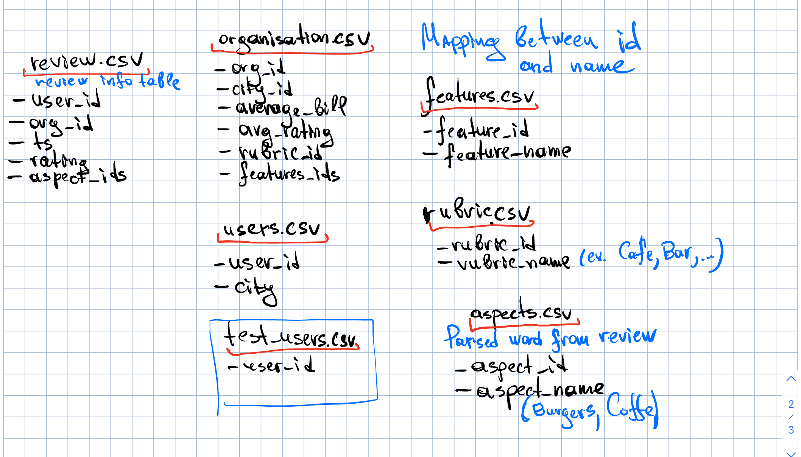

# RankingYSDA
There are basic backbone approaches of Ranking and Recommendation

## 1. Ranking
Build a small search engine that allows you to rank organizations by user request.

## 2. RecSys
Recommend best places to go for users that travel to another city.

## 3. Recommendation service
Making Eats recommendation for users that travel from hometown to another. Trying to achieve better `MNAP`

